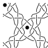
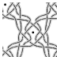
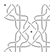

# Deprecated Generators

These old generators (most recent first) may still have a use case but they are no longer maintained.

| Image | Link                                                                                                                                                                            | Description                                                                                                                                                                                                                                                                              |
|-------|---------------------------------------------------------------------------------------------------------------------------------------------------------------------------------|:-----------------------------------------------------------------------------------------------------------------------------------------------------------------------------------------------------------------------------------------------------------------------------------------|
|  | [interactive web page](https://jo-pol.github.io/DiBL/grounds/index.html)   + [InkScape plugin](https://github.com/d-bl/inkscape-bobbinlace/releases/tag/DiBL-Inkscape-0.7.0) | Limited set of stitches. Fixed set of patterns. Thread diagrams only from a table of stitches.    The plugin can change the thread styles of downloaded diagrams, it is not upgraded to Inkscape 1.0.                                                                              |
|  | [desktop application](https://github.com/d-bl/bobbinwork/wiki)                                                                                                                  | Only about a dozen traditional grounds and braids. An export of stitch by stitch images can be imported by third party tools to create an animated image that show a working order. You can try to execute it with [OpenJDK 8](https://adoptopenjdk.net/releases.html?variant=openjdk8). |
|  | [interactive web page](https://jo-pol.github.io/flanders/)                                                                                                                      | Flanders only. No Pair diagrams. Works even with old browsers.                                                                                                                                                                                                                           |