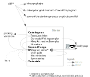

D-BL offers a roof to a suite of projects and applications related to bobbin lace.
The applications are available with an open source license and the documentation has a creative-commons license. 

**[Overview](https://github.com/d-bl)** - [history](https://d-bl.github.io/history) - [glossary](https://d-bl.github.io/glossary)

Contact
=======

* [Contact form](https://groundforge.wordpress.com/): a private message to the support team (no account required)
* </img>  [Issues](https://github.com/d-bl/GroundForge/issues) on GitHub: list of known bugs and desired features (browse without account)
* </img>  [Discord](https://discord.com/channels/1074087445169184940) channel: chat in text, voice and/or video (visible only with an account)
*   [Instagram](https://www.instagram.com/explore/tags/groundforge/): show off patterns and samples (partially visible without account, please tag your posts with `#groundforge`; mixed with some black smithing)
* </img>  [groups.io](https://groups.io/g/GroundForge/topics) an add/tracking free (mail) group
  with a public archive of message, images and more. Sign up to participate or just get notifications or use your rss-feeder.

Site map
========
[same image](images/site-map.svg) with links, reflects the official version.

